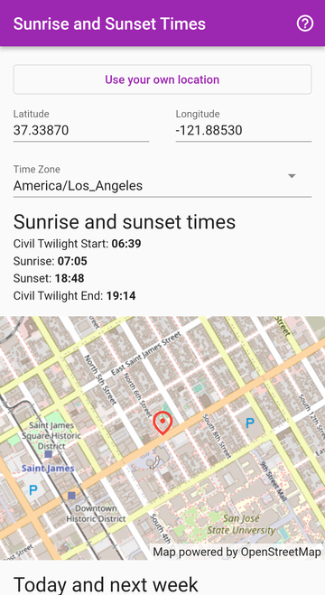

# Sunrise and Sunset Times App

Sunrise and sunset time calculator.
[Open the app](https://lwchkg.github.io/sunrise_sunset_calculator/) in your
browser.

## How to use

1. [Open the app](https://lwchkg.github.io/sunrise_sunset_calculator/).
2. Allow the use of your location.
3. **If you care more about sunlight than actual sunrise and sunset (which I
   do), check the civil twilight times.**
4. Scroll down to view the sunrise and sunset times for the next 7 days.
5. For other days click “More days...”.

## Accuracy of sunrise and sunset times

The algorithm in
[NOAA Sunrise/Sunset and Solar Position Calculators](https://gml.noaa.gov/grad/solcalc/calcdetails.html)
is used in this app. According to its web site, “sunrise and sunset results are
theoretically accurate to within a minute for locations between +/- 72°
latitude, and within 10 minutes outside of those latitudes. However, due to
variations in atmospheric composition, temperature, pressure and conditions,
observed values may vary from calculations.”

## Screenshots

## Similar calculators

[US Naval Observatory](https://aa.usno.navy.mil/data/RS_OneDay) - might be more
accurate than this app, especially if you live in the arctic circle.

[Stonekick Sun Position App](https://stonekick.com/sunposition.html) - more
information, but only the information of the current day is free.
